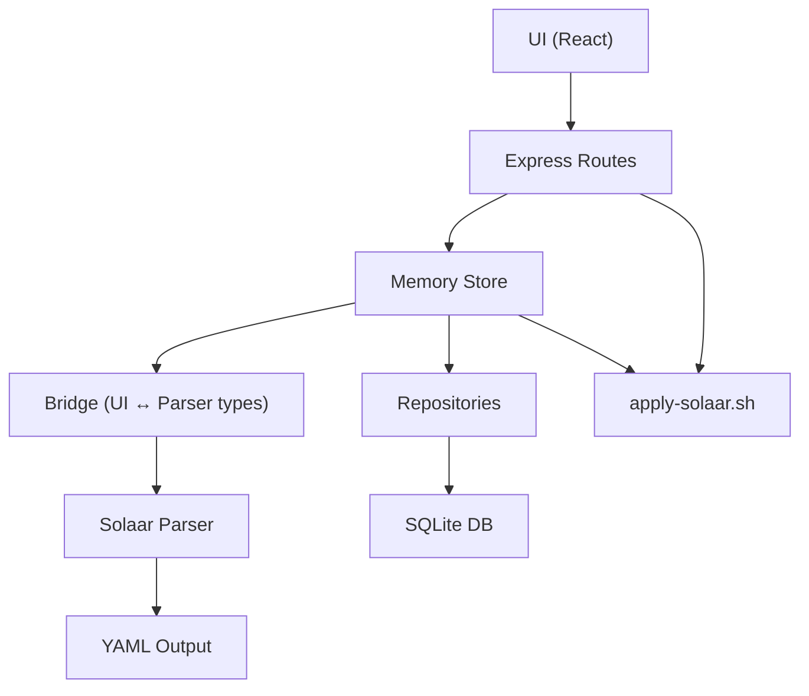

# Persistencia SQLite — Walkthrough

## Resumen

Se implementó la capa de persistencia completa con SQLite (`better-sqlite3`) para el servidor Express de LogiTux, reemplazando el almacenamiento en archivos JSON.

## Archivos Creados

### Base de datos
| Archivo | Propósito |
|---|---|
| [schema.sql](file:///home/gzzy/Desktop/workspace/logitux-web/server/db/schema.sql) | 4 tablas: `devices`, `profiles`, `configs`, `scripts` + índices |
| [index.ts](file:///home/gzzy/Desktop/workspace/logitux-web/server/db/index.ts) | Singleton SQLite con WAL + FK, ejecuta schema al iniciar |
| [device.repo.ts](file:///home/gzzy/Desktop/workspace/logitux-web/server/db/repositories/device.repo.ts) | CRUD con UPSERT, metadata JSON (buttons, DPI) |
| [profile.repo.ts](file:///home/gzzy/Desktop/workspace/logitux-web/server/db/repositories/profile.repo.ts) | CRUD completo, `buttons` y `windowClasses` como JSON |
| [config.repo.ts](file:///home/gzzy/Desktop/workspace/logitux-web/server/db/repositories/config.repo.ts) | Integra con parser: [saveConfig()](file:///home/gzzy/Desktop/workspace/logitux-web/server/db/repositories/config.repo.ts#70-94) llama [jsonToSolaarYaml()](file:///home/gzzy/Desktop/workspace/logitux-web/server/solaar/parser.ts#106-157) |
| [script.repo.ts](file:///home/gzzy/Desktop/workspace/logitux-web/server/db/repositories/script.repo.ts) | CRUD + sync a disco + validación de comandos peligrosos + seed |

### Estado en memoria
| Archivo | Propósito |
|---|---|
| [bridge.ts](file:///home/gzzy/Desktop/workspace/logitux-web/server/state/bridge.ts) | Convierte `ButtonConfig[]` ↔ [ProfileConfig](file:///home/gzzy/Desktop/workspace/logitux-web/server/solaar/schema.ts#35-40) (UI ↔ parser) |
| [memory-store.ts](file:///home/gzzy/Desktop/workspace/logitux-web/server/state/memory-store.ts) | Cache de configs, rollback, bootstrap desde DB |

## Archivos Modificados

| Archivo | Cambio |
|---|---|
| [profiles.ts](file:///home/gzzy/Desktop/workspace/logitux-web/server/routes/profiles.ts) | **Reescrito**: archivo JSON → SQLite, +PUT, +GET/:id |
| [config.ts](file:///home/gzzy/Desktop/workspace/logitux-web/server/routes/config.ts) | **Reescrito**: integra memory-store, rollback, +PUT sin apply |
| [scripts.ts](file:///home/gzzy/Desktop/workspace/logitux-web/server/routes/scripts.ts) | **Reescrito**: CRUD completo con disk sync |
| [buttons.ts](file:///home/gzzy/Desktop/workspace/logitux-web/server/routes/buttons.ts) | +[upsertDevice()](file:///home/gzzy/Desktop/workspace/logitux-web/server/db/repositories/device.repo.ts#75-94) + [setCurrentDevice()](file:///home/gzzy/Desktop/workspace/logitux-web/server/state/memory-store.ts#63-67) al detectar |
| [index.ts](file:///home/gzzy/Desktop/workspace/logitux-web/server/index.ts) | +`import './db/index.js'`, +`GET /api/bootstrap` |
| [types.ts](file:///home/gzzy/Desktop/workspace/logitux-web/server/types.ts) | +[Script](file:///home/gzzy/Desktop/workspace/logitux-web/server/db/repositories/script.repo.ts#28-37), +[BootstrapData](file:///home/gzzy/Desktop/workspace/logitux-web/server/state/memory-store.ts#33-39) |
| [jest.config.ts](file:///home/gzzy/Desktop/workspace/logitux-web/jest.config.ts) | +roots `server/db`, `server/state` |
| [.gitignore](file:///home/gzzy/Desktop/workspace/logitux-web/.gitignore) | +`data/*.db`, `data/*.db-wal`, `data/*.db-shm` |

## Arquitectura

## Flujo: Guardar y aplicar un perfil

1. UI envía `POST /api/config` con `ButtonConfig[]`
2. `config.ts` toma snapshot para rollback
3. Memory-store llama `bridge.ts` → convierte a `ProfileConfig`
4. Parser genera YAML con `jsonToSolaarYaml()`
5. `config.repo` persiste JSON + YAML en tabla `configs`
6. `configGenerator` produce YAML para Solaar (formato aplicación)
7. `apply-solaar.sh` escribe archivos y reinicia Solaar
8. Si falla → rollback automático restaura estado anterior

## Endpoints nuevos

- `GET /api/bootstrap` — devuelve `{devices, profiles, configs, scripts}`
- `PUT /api/config` — guarda config en DB sin aplicar a Solaar
- `PUT /api/profiles/:id` — actualiza perfil existente
- `GET /api/profiles/:id` — obtiene perfil por ID
- `POST/PUT/DELETE /api/scripts` — CRUD completo de scripts

## Pendiente

> [!NOTE]
> Falta que instales `better-sqlite3` y `@types/better-sqlite3` para que compile. Una vez instalado, el servidor creará `data/logitux.db` automáticamente al iniciar.

- [ ] Tests unitarios para repositorios y memory-store
- [ ] Verificar compilación con `npm run dev:server`
- [ ] Verificar que los tests existentes del parser siguen pasando
